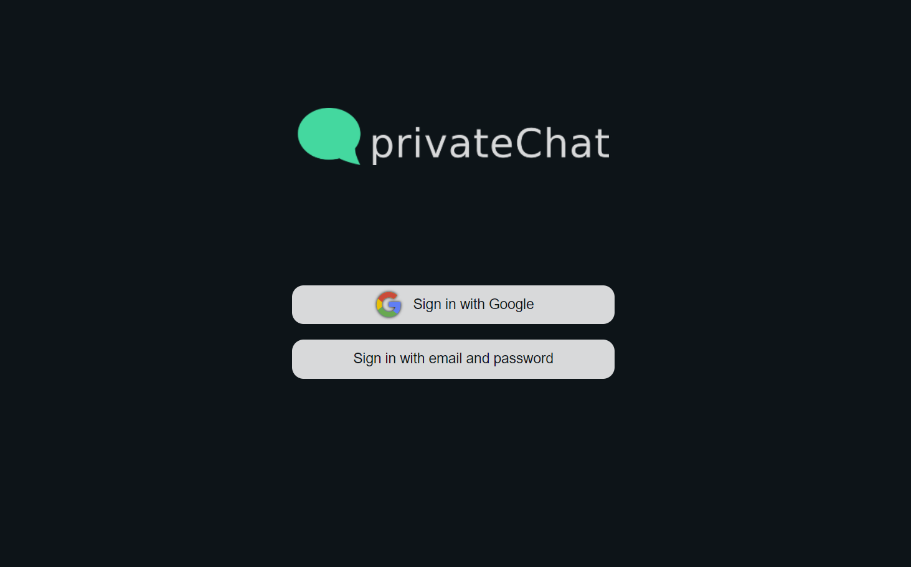
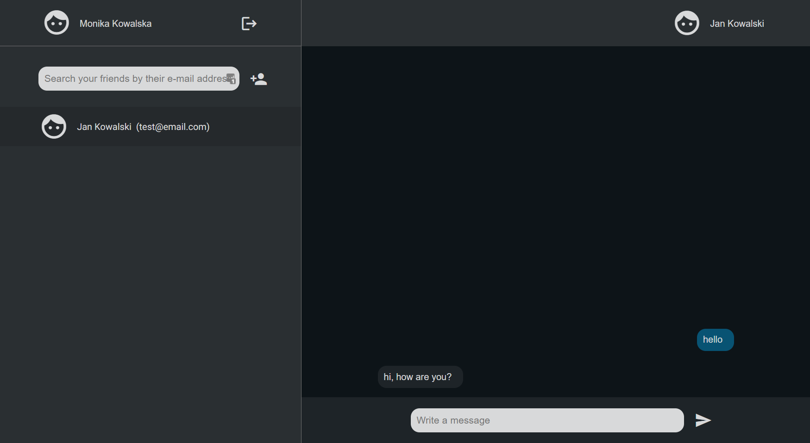

# PrivateChat

End to end encrypted chat built with [libsignal-protocol-typescript](https://github.com/privacyresearchgroup/libsignal-protocol-typescript), angular and firebase.

[click here to see the Live Demo](https://privatechat2-1d108.web.app/)

## Features

- user login and registration
- adding users to the contact list
- real-time message exchange
- automatic encryption and decryption of messages

  <b> (serwer stores only encrypted messages and public keys, all decrypted data and private keys are stored locally, in local storage of users browser) </b>

- full responsiveness of the website

## Screenshots

&nbsp;

